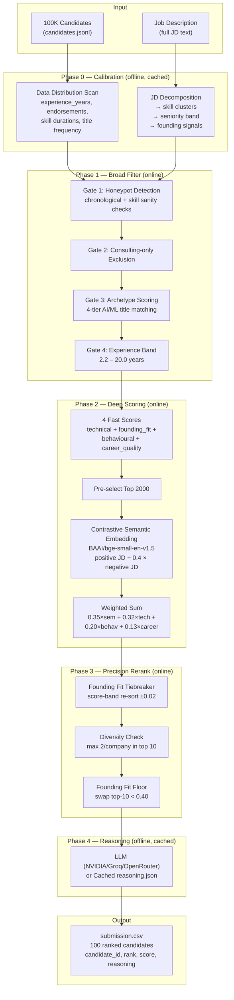

# System Architecture



---

## Quick Reference — Per-Slide Breakdown

| Slide | Content |
|---|---|
| **Title** | Resume Ranker — Candidate Ranking for Founding AI Role |
| **Problem** | Rank 100K candidates with CPU-only, 5-min budget |
| **Architecture** | Paste the rendered Mermaid diagram |
| **Key Heuristics** | MIN_RESPONSE_RATE=0.15, MIN_ARCHETYPE_SCORE=0.05, DIVERSITY_PENALTY=0.05, TIEBREAKER_BAND=0.02 |
| **Weighted Score** | semantic=0.35, technical=0.32, behavioural=0.20, career_quality=0.13 |
| **Honeypot Detection** | 929 planted, 0 in top-100 |
| **Results** | 100 candidates ranked, fully cached, runs in ~30s |

---

## Rendering for Slides

1. Open https://mermaid.live
2. Paste the diagram (content between ` ```mermaid ` and ` ``` `)
3. Export as PNG — paste into your slide deck
